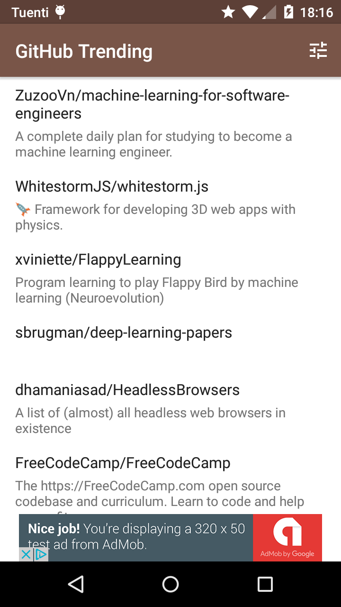
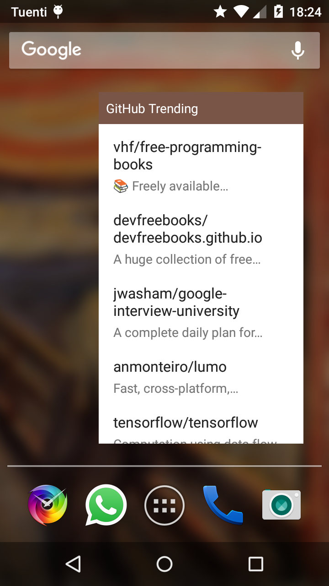
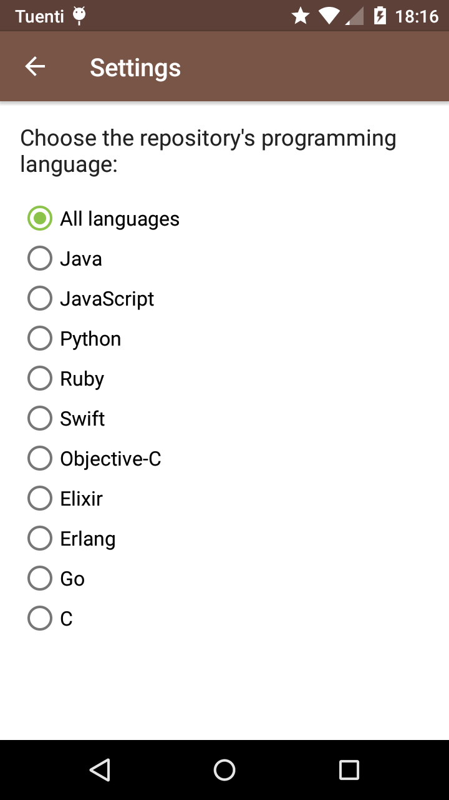

# GitHub Trending

Final project of the Udacity's [Android Developer Nanodegree](https://www.udacity.com/course/android-developer-nanodegree-by-google--nd801).

This Android app displays the trending GitHub repositories (the same you can find in [https://github.com/trending](https://github.com/trending)).

It implements a Sync Adapter that fetches data periodically and stores it into a Content Provider. It has a home-screen collection widget. It displays ads using AdMob.

## Screenshots

#### Main Activity

 

#### Home-Screen Collection Widget

 

#### Settings Activity

